# sgspage
SG Service Plus Page

## Architecture 

```mermaid
flowchart TB
    subgraph "Developer Environment"
        DEV[Developer] -->|Git Push| GIT[GitHub Repository]
        DEV -->|Local Development| CODE[HTML/CSS/JS Files]
        CODE -->|Commit| GIT
    end

    subgraph "GitHub"
        GIT -->|Trigger| ACTION[GitHub Actions]
        ACTION -->|Build| BUILD[Build Process]
        BUILD -->|Deploy| PAGES[GitHub Pages]
    end

    subgraph "Cloudflare"
        DNS[Cloudflare DNS] -->|CNAME Record| PAGES
        CF_PAGES[Cloudflare Pages] -->|Deploy| PAGES
        CF_CACHE[Cloudflare Cache] -->|Cache Content| CF_PAGES
        CF_SSL[SSL/TLS] -->|Secure Connection| CF_CACHE
        CF_WAF[Web Application Firewall] -->|Protect| CF_SSL
    end

    subgraph "End User"
        USER[User Browser] -->|DNS Query| DNS
        USER -->|HTTPS Request| CF_WAF
    end

    style DNS fill:#f9a825
    style CF_PAGES fill:#f9a825
    style CF_CACHE fill:#f9a825
    style CF_SSL fill:#f9a825
    style CF_WAF fill:#f9a825
    style GIT fill:#24292e
    style ACTION fill:#24292e
    style BUILD fill:#24292e
    style PAGES fill:#24292e
```



 ## Deployment

 ```mermaid
sequenceDiagram
    participant Dev as Developer
    participant Git as GitHub
    participant CF as Cloudflare Pages
    participant DNS as Cloudflare DNS
    participant User as End User

    Dev->>Git: Push code changes
    Git->>CF: Trigger build webhook
    CF->>Git: Pull latest code
    CF->>CF: Build site
    CF->>CF: Deploy to CDN
    DNS->>CF: Update DNS records
    
    Note over CF,DNS: Site is live

    User->>DNS: Request domain
    DNS->>User: Return Cloudflare IP
    User->>CF: Request page
    CF->>User: Serve cached content
 ``` 